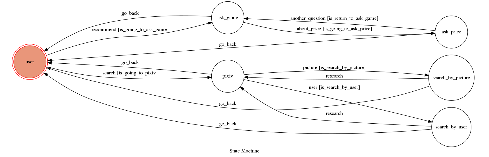

# TOC Project 2019

## Finite State Machine

### Feature
* use nlp to analyze message
* parse website and send image from imgur
* deploy on heroku

### How to interact with chatbot

### - Recommend games

1. tell chatbot you want some suggestion to buy games
- keyword: 推薦
2. tell chatbot which type of game you want to play
3. tell chatbot your budget
4. get url of the game

### - Search picture

My original plan is to get picture from pixiv, but pixiv has to login 
to get picture, so I change to imgur
1. tell chatbot you want to search picture on pixiv
- keyword: pixiv
2. there are two options to search
- search by picture: enter keyword to search
- search by user: this option is originally design for pixiv, so it is unuse now
3. get at most 5 picture from imgur
